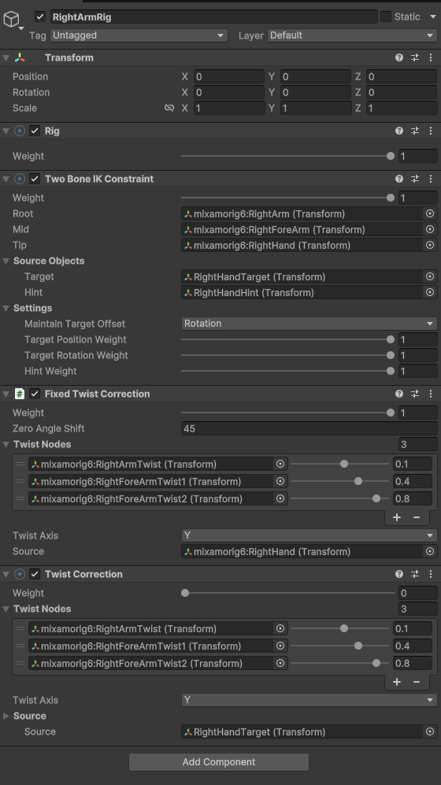

# Animation Rigging Extensions

This repository contains `FixedTwistCorrection` to be able to:  
1. Use initial Bone angles during chained rotation  
2. Add variable initial angle shift  

## Getting Started

To get started, follow these steps:

1. Clone the repository.
2. Put `AnimationRiggingExtensions` to your `Assets` folder.
3. `FixedTwistCorrection` is now available to add to your `Rig`s.

## Note
You'll have to add "twisted bones" to your model. More information is 
[here](https://medium.com/@oleg.vashenkov/blender-unity-ik-drivers-hands-2753e541ac14)

